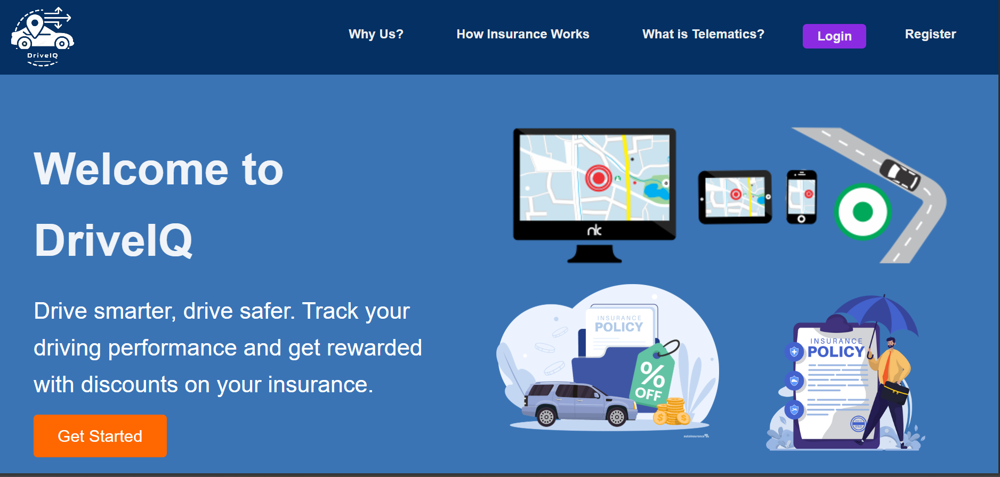
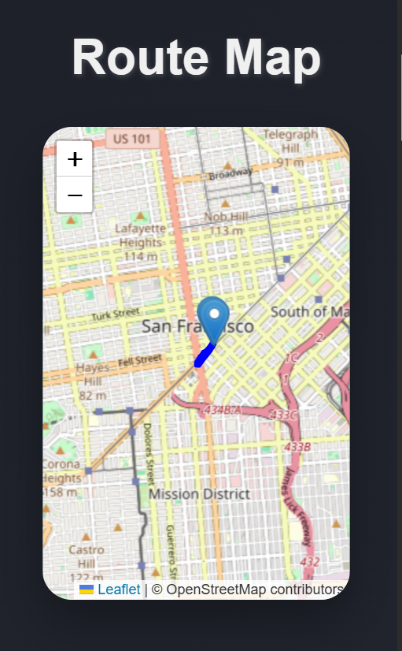

# DriveIQ

DriveIQ is an advanced telematics platform that transforms driving data into actionable insights for insurance companies and drivers, extending beyond mileage-based risk assessments. The platform comprises three key components: `DriveIQ-backend`, `ml_model`, and `DriveIQ-PWA`.

## Project Structure

DriveIQ/ ├── DriveIQ-backend/ # Flask REST API for data processing and integration │ └── app/ # Application folder with server code ├── ml_model/ # Machine learning models for scoring and risk categorization └── DriveIQ-PWA/ # Progressive Web Application for user and admin interfaces


## Features

- **Dual Interfaces**: Separate dashboards for drivers and insurance admins.
- **Real-Time GPS Data Analysis**: Metrics include speed, acceleration, jerk, and heading changes.
- **Sensitive Area Detection**: Uses Google Geolocation API and OpenStreetMap API to detect violations within 300 meters of schools and hospitals.
- **Three Machine Learning Models**:
  1. Real-time scoring model for individual trips.
  2. Multi-day consolidated data model for admins.
  3. Bulk data analysis model for JSON/CSV uploads.
- **Secure Access**: JWT-based authentication.
- **Real-Time Updates**: Socket.io for real-time event handling and a PWA for offline capabilities.

## Technology Stack

- **Frontend**: React (Progressive Web App)
- **Backend**: Flask REST API
- **Database**: SQLite
- **Authentication**: JWT
- **Machine Learning**: Random Forest, SHAP (Explainable AI), k-fold cross-validation
- **APIs**:
  - Google Geolocation API
  - OpenStreetMap API

## Installation

### Backend Setup (DriveIQ-backend)
1. **Clone the repository**:
   ```bash
   git clone https://github.com/yourusername/DriveIQ.git
   cd DriveIQ/DriveIQ-backend/app
Create a virtual environment and install dependencies:


python -m venv venv
source venv/bin/activate  # On Windows: venv\Scripts\activate
pip install -r ../requirements.txt
Run the backend server:


python server.py
Machine Learning Model Setup (ml_model)
Navigate to the ml_model directory:

cd ../../ml_model
Ensure required dependencies are installed:


pip install -r requirements.txt
Frontend Setup (DriveIQ-PWA)
Navigate to the DriveIQ-PWA directory:


cd ../DriveIQ-PWA
Install dependencies and run the application:


npm install
npm start

## Usage

### Backend Integration with Machine Learning Models
- The backend processes GPS data and interacts with the machine learning models to evaluate driving behavior in real-time, daily, and multi-day contexts.
- Admins can upload JSON/CSV files for bulk trip analysis.

# API Documentation

## Admin API Endpoints

### 1. **Get All Drivers**
- **URL**: `/admin/drivers`
- **Method**: `GET`
- **Response**:
  - `200 OK`: Returns a list of all drivers.

---

### 2. **Get Driver's Daily Data**
- **URL**: `/admin/driver/all_daily_data/<int:driver_id>`
- **Method**: `GET`
- **Response**:
  - `200 OK`: Aggregated daily data for the given driver.

---

### 3. **Get Bulk Consolidated Data**
- **URL**: `/admin/driver/bulk_consolidated_data/<int:driver_id>`
- **Method**: `GET`
- **Response**:
  - `200 OK`: Consolidated data for the given driver, including driving scores and model-predicted results.

---

### 4. **Process GPS Data**
- **URL**: `/admin/process_gps_data`
- **Method**: `POST`
- **Request Body**:
  ```json
  [
    {
      "Latitude": 12.34,
      "Longitude": 56.78,
      "Speed": 40.0,
      "Acceleration": 2.1,
      "Timestamp": "2024-12-01T12:00:00Z",
      "HeadingChange": 15.0
    },
    ...
  ]

# Driver API Endpoints

## 1. **Register Driver**
- **URL**: `/register`
- **Method**: `POST`
- **Request Body** (Form Data):
  - `name`: Driver's name
  - `email`: Driver's email
  - `password`: Driver's password
  - `accepted_terms`: Boolean value indicating if terms were accepted
  - `identity_proof`: Driver's identity proof file (PNG, JPG, JPEG, GIF)

- **Response**:
  - `201 Created`: Successful registration with a JWT token.
  - `400 Bad Request`: Missing or invalid data.

---

## 2. **Login Driver**
- **URL**: `/login`
- **Method**: `POST`
- **Request Body**:
  ```json
  {
    "email": "driver_email",
    "password": "driver_password"
  }

## 3. **Record Telematics Data**
- **URL**: `/record-telematics`
- **Method**: `POST`
- **Authorization**: JWT Token required
- **Request Body**:
  ```json
  {
    "gps_data": [
      {
        "Latitude": 12.34,
        "Longitude": 56.78,
        "Speed": 40.0,
        "Acceleration": 2.1,
        "Timestamp": "2024-12-01T12:00:00Z",
        "HeadingChange": 15.0
      },
      ...
    ],
    "driver_id": 1
  }

## 4. **Unregister Driver**
- **URL**: `/unregister`
- **Method**: `POST`
- **Request Body**:
  ```json
  {
    "email": "driver_email",
    "password": "driver_password"
  }

## 5. **Process Daily Data**
- **URL**: `/process-daily-data`
- **Method**: `POST`
- **Authorization**: JWT Token required
- **Request Body**:
  ```json
  {
    "driver_id": 1
  }

## Screenshots

### 1. **Homepage**  


---

### 2. **Login Page**  


---

### 3. **Driver Page**  


---

### 4. **Driver Dashboard with Map & Graphs**  


---

### 5. **Batch Data Processing & Daily Scores**  
  


---

### 6. **Admin Dashboard**  


---

### 7. **Driver Data Overview**  


---

### 8. **Comparison of Consolidated Metrics and ML Predicted Scores**  


## Future Enhancements

- **PWA Optimization**: Faster response times and offline support.
- **Real-Time Notifications**: Using Socket.io for event-driven updates.

## Contributing

Contributions are welcome! Feel free to open issues or submit pull requests for enhancements.

## License

This project is licensed under the MIT License.


